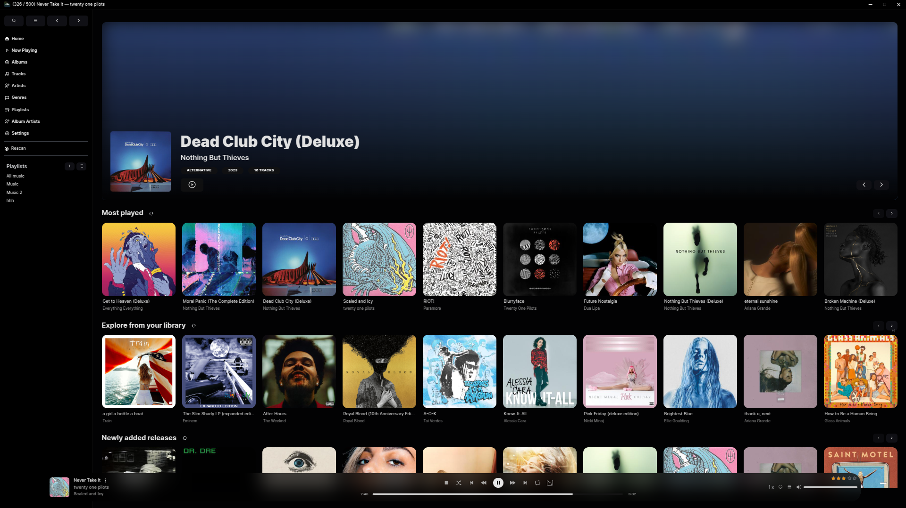
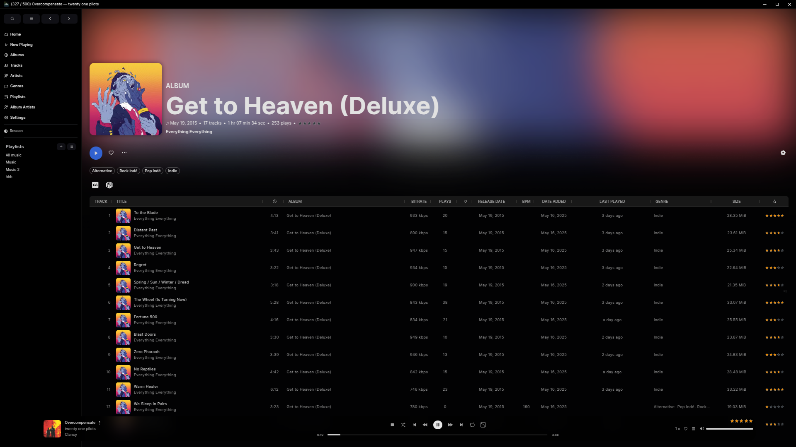
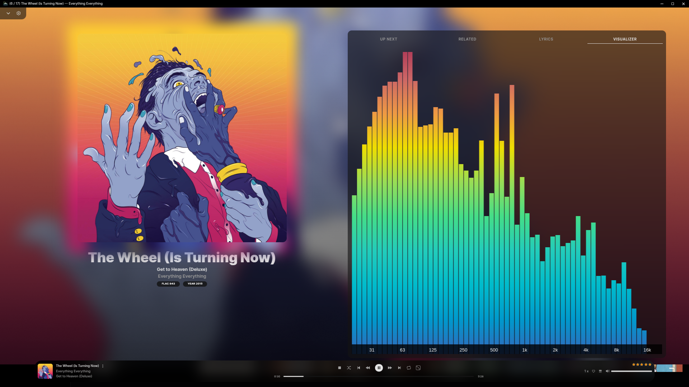
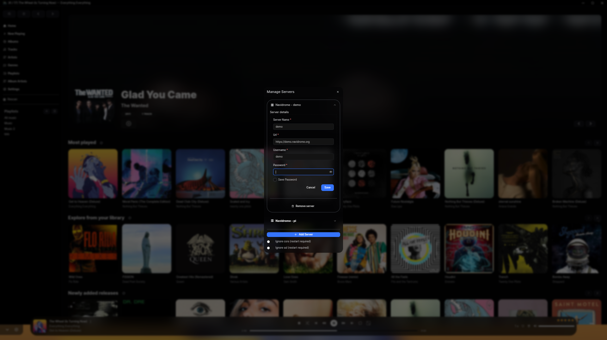
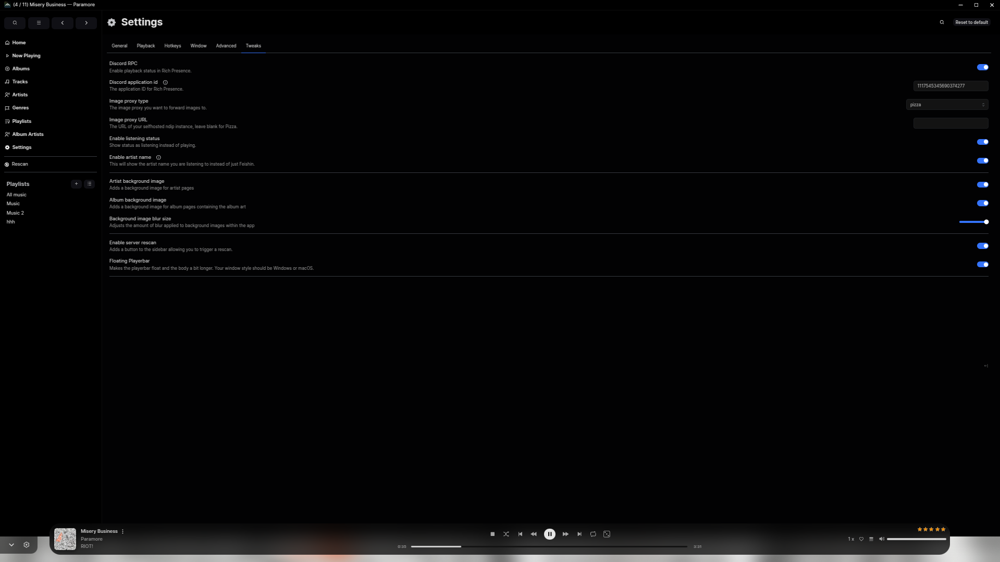
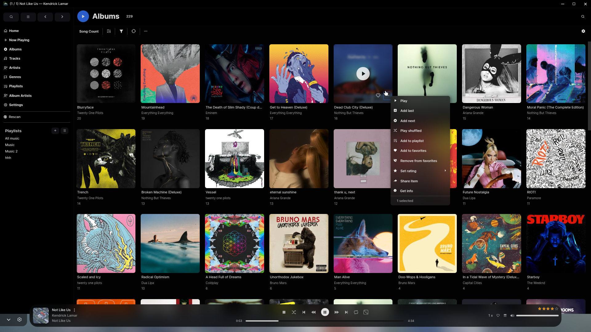

# iiPython Feishin Fork

Fork of [Feishin](https://github.com/jeffvli/feishin) with improved features and a new theme.

## Features

- [x] Full Feishin featureset
- [x] Unfiltered custom CSS (sanitization removed)
- [x] Custom Discord RPC with support for "Listening to [artist]" and proxied art
- [x] Scrapped features such as Server Rescan
- [x] Redesigned dark theme
- [x] Album Ambient Mode, Floating Playerbar, hiding "DISC 1", more UX tweaks
- [x] New icon
- [ ] ~~Request a feature~~ We add new fork features at our discretion.

## Gallery

<p align="center">
  
  
  
  
  
  
</p>

## Getting Started

Builds of the fork are tested on Arch Linux but work on Windows and should be fine on macOS. **Compiling MUST be done via pnpm or else the packaged app will not execute.**

### Arch Linux

Simply download the AUR package:

```sh
yay -S iipython-feishin-bin
```

### Everything else

You can find prebuilt binaries in the [Release tab.](https://github.com/iiPythonx/feishin/releases/tag/25.06.12)

If you want to build yourself, you can use the standard steps.

```
pnpm i
pnpm run package
```


#### macOS Notes

If you're using a device running macOS 12 (Monterey) or higher, [check here](https://github.com/jeffvli/feishin/issues/104#issuecomment-1553914730) for instructions on how to remove the app from quarantine.

For media keys to work, you will be prompted to allow Feishin to be a Trusted Accessibility Client. After allowing, you will need to restart Feishin for the privacy settings to take effect.

### Configuration

1. Upon startup, you will be prompted to select a server. Click the `Open menu` button and select `Manage servers`. Click the `Add server` button in the popup and fill out all applicable details. You will need to enter the full URL to your server, including the protocol and port if applicable (e.g. `https://navidrome.my-server.com` or `http://192.168.0.1:4533`).

- **Navidrome** - For the best experience, select "Save password" when creating the server and configure the `SessionTimeout` setting in your Navidrome config to a larger value (e.g. 72h).
    - **Linux users** - The default password store uses `libsecret`. `kwallet4/5/6` are also supported, but must be explicitly set in Settings > Window > Passwords/secret score.

3. _Optional_ - If you want to host Feishin on a subpath (not `/`), then pass in the following environment variable: `PUBLIC_PATH=PATH`. For example, to host on `/feishin`, pass in `PUBLIC_PATH=/feishin`.

4. _Optional_ - To hard code the server url, pass the following environment variables: `SERVER_NAME`, `SERVER_TYPE` (one of `jellyfin` or `navidrome`), `SERVER_URL`. To prevent users from changing these settings, pass `SERVER_LOCK=true`. This can only be set if all three of the previous values are set.

## FAQ

### MPV is either not working or is rapidly switching between pause/play states

First thing to do is check that your MPV binary path is correct. Navigate to the settings page and re-set the path and restart the app. If your issue still isn't resolved, try reinstalling MPV. Known working versions include `v0.35.x` and `v0.36.x`. `v0.34.x` is a known broken version.

### What music servers does Feishin support?

Feishin supports any music server that implements a [Navidrome](https://www.navidrome.org/), [Jellyfin](https://jellyfin.org/), or [OpenSubsonic compatible](https://opensubsonic.netlify.app/) API.

- [Navidrome](https://github.com/navidrome/navidrome)
- [Jellyfin](https://github.com/jellyfin/jellyfin)
- [OpenSubsonic](https://opensubsonic.netlify.app/) compatible servers, such as...
    - [Airsonic-Advanced](https://github.com/airsonic-advanced/airsonic-advanced)
    - [Ampache](https://ampache.org)
    - [Astiga](https://asti.ga/)
    - [Funkwhale](https://www.funkwhale.audio/)
    - [Gonic](https://github.com/sentriz/gonic)
    - [LMS](https://github.com/epoupon/lms)
    - [Nextcloud Music](https://apps.nextcloud.com/apps/music)
    - [Supysonic](https://github.com/spl0k/supysonic)
    - More (?)

### I have the issue "The SUID sandbox helper binary was found, but is not configured correctly" on Linux

This happens when you have user (unprivileged) namespaces disabled (`sysctl kernel.unprivileged_userns_clone` returns 0). You can fix this by either enabling unprivileged namespaces, or by making the `chrome-sandbox` Setuid.

```bash
chmod 4755 chrome-sandbox
sudo chown root:root chrome-sandbox
```

Ubunutu 24.04 specifically introduced breaking changes that affect how namespaces work. Please see https://discourse.ubuntu.com/t/ubuntu-24-04-lts-noble-numbat-release-notes/39890#:~:text=security%20improvements%20 for possible fixes.

## Development

Built and tested using Node `v23.11.0`.

This project is built off of [electron-vite](https://github.com/alex8088/electron-vite)

- `pnpm run dev` - Start the development server
- `pnpm run dev:watch` - Start the development server in watch mode (for main / preload HMR)
- `pnpm run start` - Starts the app in production preview mode
- `pnpm run build` - Builds the app for desktop
- `pnpm run build:electron` - Build the electron app (main, preload, and renderer)
- `pnpm run build:remote` - Build the remote app (remote)
- `pnpm run build:web` - Build the standalone web app (renderer)
- `pnpm run package` - Package the project
- `pnpm run package:dev` - Package the project for development
- `pnpm run package:linux` - Package the project for Linux
- `pnpm run package:mac` - Package the project for Mac
- `pnpm run package:win` - Package the project for Windows
- `pnpm run publish:linux` - Publish the project for Linux
- `pnpm run publish:linux-arm64` - Publish the project for Linux ARM64
- `pnpm run publish:mac` - Publish the project for Mac
- `pnpm run publish:win` - Publish the project for Windows
- `pnpm run typecheck` - Type check the project
- `pnpm run typecheck:node` - Type check the project with tsconfig.node.json
- `pnpm run typecheck:web` - Type check the project with tsconfig.web.json
- `pnpm run lint` - Lint the project
- `pnpm run lint:fix` - Lint the project and fix linting errors
- `pnpm run i18next` - Generate i18n files

## Translation

Fork features are hardcoded English, sorry. You can use upstream [Weblate](https://hosted.weblate.org/projects/feishin/) for anything else.

## License

[GNU General Public License v3.0 ©](https://github.com/jeffvli/feishin/blob/dev/LICENSE)
